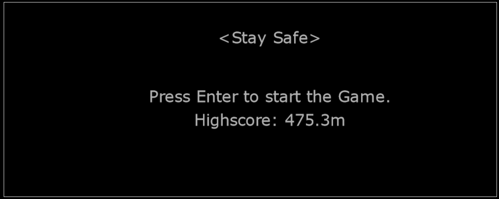
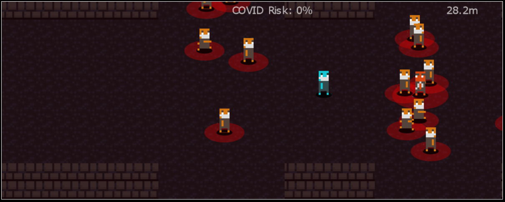

# Stay Safe -- GameJam Entry

Entry of the [2021 JS13K GameJam](https://js13kgames.com/entries/stay-safe).





**Description**  
Do you ever feel unpleasant when travelling through crowded places? Now that Corona has entered
our everyday lives, this has become even more of a struggle: "Stay away from everyone else as
far as possible. Stay safe!"

You may think to yourself: "This sucks! I can't wait to get home so I can stop thinking about
this whole Corona stuff."
So ... Why not bring the struggle home? With our fantastic game, you can relive your daily
traumatic struggle of avoiding people and avoiding Corona!

Your objective: Stay away from everyone else as much as possible. Be careful: Q Anon people
don't wear masks and therefore have a higher chance of infecting you. But don't worry:
occasionally, you can pick up vaccines that will lower your likelihood of getting infected.
Stay safe and keep your space!

## Boilerplate

**Credts:** [Jerome Lecomte](https://github.com/herebefrogs) for his original boilerplate from which I based this one.

### Requirements
- Node.js `>= v10`
- Zip (compatible with info-zip command line).
- [AdvZip](https://github.com/amadvance/advancecomp).

### Commands

Development mode

```
npm start
```

> It will open the browser, rebuild on changes and reload the browser.

Production mode
```
npm run build
```

> It will minify, compress and inline styles and scripts in a single html file. It will also zip the file.

The generated files will be available in the `dist` directory.

### Development notes

The entry point for the application is the file `src/index.js`, from there any import will be automatically solved by `rollup` including external dependencies installed in `node_modules` folder. This includes `css` files thanks to [postcss](https://github.com/postcss/postcss).

The file `src/index.html` will be used as a template for the final bundle.

> The files `src/index.js` and `src/index.html` **are mandatory** for the scripts to work.

In production mode:

- The javascript code is optimized thanks to [terser](https://github.com/terser/terser).
- The javascript and styles _bundles are inlined in a single html file_ thanks to `html-inline` (and minified thanks to `html-minifier`).
- The zip file will only contain the single inlined html bundle.
